# Module: `ui`

_Generated: 2026-04-18_

## File Dependencies

```mermaid
graph LR
  dashboard_tui_tsx --> use_dashboard_data
  dashboard_tui_tsx --> use_metrics_data
  dashboard_tui_tsx --> use_navigation
  dashboard_tui_tsx --> use_usage_analytics_data
  dashboard_tui_tsx --> types
  dashboard_tui_tsx --> tui_adapter_interface
  header_tsx --> tui_adapter_interface
  help_bar_tsx --> types
  help_bar_tsx --> tui_adapter_interface
  tab_bar_tsx --> types
  tab_bar_tsx --> tui_adapter_interface
  command_history_panel_tsx --> format_helpers
  command_history_panel_tsx --> tui_adapter_interface
  exploration_info_panel_tsx --> format_helpers
  exploration_info_panel_tsx --> tui_adapter_interface
  optimization_panel_tsx --> tui_adapter_interface
  quality_panel_tsx --> tui_adapter_interface
  running_task_panel_tsx --> format_helpers
  running_task_panel_tsx --> tui_adapter_interface
  session_info_panel_tsx --> format_helpers
  session_info_panel_tsx --> tui_adapter_interface
  spending_panel_tsx --> tui_adapter_interface
  token_usage_panel_tsx --> tui_adapter_interface
  tool_calls_panel_tsx --> format_helpers
  tool_calls_panel_tsx --> tui_adapter_interface
  worktree_stats_panel_tsx --> format_helpers
  worktree_stats_panel_tsx --> tui_adapter_interface
  use_dashboard_data --> types
  use_metrics_data --> types
  use_navigation --> types
  active_sessions_panel_tsx --> format_helpers
  active_sessions_panel_tsx --> tui_adapter_interface
  background_tasks_panel_tsx --> types
  background_tasks_panel_tsx --> format_helpers
  background_tasks_panel_tsx --> tui_adapter_interface
  metrics_summary_panel_tsx --> types
  metrics_summary_panel_tsx --> tui_adapter_interface
  recent_commands_panel_tsx --> types
  recent_commands_panel_tsx --> format_helpers
  recent_commands_panel_tsx --> tui_adapter_interface
  server_metrics_panel_tsx --> tui_adapter_interface
  system_health_panel_tsx --> types
  system_health_panel_tsx --> format_helpers
  system_health_panel_tsx --> tui_adapter_interface
  worktree_diagram_panel_tsx --> types
  worktree_diagram_panel_tsx --> format_helpers
  worktree_diagram_panel_tsx --> tui_adapter_interface
  agent_analytics_view_tsx --> use_metrics_data
  agent_analytics_view_tsx --> tui_adapter_interface
  audit_log_view_tsx --> use_metrics_data
  audit_log_view_tsx --> format_helpers
  audit_log_view_tsx --> tui_adapter_interface
  cache_stats_view_tsx --> use_metrics_data
  cache_stats_view_tsx --> format_helpers
  cache_stats_view_tsx --> tui_adapter_interface
  dashboard_view_tsx --> types
  dashboard_view_tsx --> tui_adapter_interface
  performance_view_tsx --> use_metrics_data
  performance_view_tsx --> tui_adapter_interface
  session_details_view_tsx --> types
  session_details_view_tsx --> tui_adapter_interface
  usage_analytics_view_tsx --> use_usage_analytics_data
  usage_analytics_view_tsx --> tui_adapter_interface
  prompt_adapter_interface --> prompt_adapter_interface
  prompt_adapter_interface --> prompt_adapter
  prompt_adapter --> prompt_adapter_interface
  spinner_adapter_interface --> spinner_adapter_interface
  spinner_adapter_interface --> spinner_adapter
  spinner_adapter --> spinner_adapter_interface
  tui_adapter_interface --> tui_adapter_interface
  tui_adapter_interface --> tui_adapter
  tui_adapter --> tui_adapter_interface
```

## Symbol References

| Symbol                      | Kind      | Defined in                   | Used in                                                                                                                                                                                                                                                                                                                                                                                                                                                                                                                                                                                                                                                                                                                              |
| --------------------------- | --------- | ---------------------------- | ------------------------------------------------------------------------------------------------------------------------------------------------------------------------------------------------------------------------------------------------------------------------------------------------------------------------------------------------------------------------------------------------------------------------------------------------------------------------------------------------------------------------------------------------------------------------------------------------------------------------------------------------------------------------------------------------------------------------------------ |
| AgentAnalyticsData          | interface | use-metrics-data.ts          | agent-analytics-view.tsx                                                                                                                                                                                                                                                                                                                                                                                                                                                                                                                                                                                                                                                                                                             |
| AppControl                  | interface | tui-adapter.interface.ts     | tui-adapter.ts                                                                                                                                                                                                                                                                                                                                                                                                                                                                                                                                                                                                                                                                                                                       |
| AuditData                   | interface | use-metrics-data.ts          | audit-log-view.tsx                                                                                                                                                                                                                                                                                                                                                                                                                                                                                                                                                                                                                                                                                                                   |
| BackgroundTask              | interface | types.ts                     | use-dashboard-data.ts, background-tasks-panel.tsx                                                                                                                                                                                                                                                                                                                                                                                                                                                                                                                                                                                                                                                                                    |
| BackgroundTasksPanel        | function  | background-tasks-panel.tsx   | dashboard-view.tsx                                                                                                                                                                                                                                                                                                                                                                                                                                                                                                                                                                                                                                                                                                                   |
| BoxProps                    | interface | tui-adapter.interface.ts     | tui-adapter.ts                                                                                                                                                                                                                                                                                                                                                                                                                                                                                                                                                                                                                                                                                                                       |
| CacheData                   | interface | use-metrics-data.ts          | cache-stats-view.tsx                                                                                                                                                                                                                                                                                                                                                                                                                                                                                                                                                                                                                                                                                                                 |
| CacheStatsView              | function  | cache-stats-view.tsx         | dashboard-tui.tsx                                                                                                                                                                                                                                                                                                                                                                                                                                                                                                                                                                                                                                                                                                                    |
| createDefaultPromptAdapter  | function  | prompt-adapter.ts            | prompt-adapter.interface.ts                                                                                                                                                                                                                                                                                                                                                                                                                                                                                                                                                                                                                                                                                                          |
| createDefaultSpinnerAdapter | function  | spinner-adapter.ts           | spinner-adapter.interface.ts                                                                                                                                                                                                                                                                                                                                                                                                                                                                                                                                                                                                                                                                                                         |
| createDefaultTUIAdapter     | function  | tui-adapter.ts               | tui-adapter.interface.ts                                                                                                                                                                                                                                                                                                                                                                                                                                                                                                                                                                                                                                                                                                             |
| DashboardData               | interface | types.ts                     | use-dashboard-data.ts, dashboard-view.tsx                                                                                                                                                                                                                                                                                                                                                                                                                                                                                                                                                                                                                                                                                            |
| DashboardTab                | type      | types.ts                     | dashboard-tui.tsx, help-bar.tsx, tab-bar.tsx, use-metrics-data.ts, use-navigation.ts                                                                                                                                                                                                                                                                                                                                                                                                                                                                                                                                                                                                                                                 |
| formatAge                   | function  | format-helpers.ts            | tool-calls-panel.tsx, active-sessions-panel.tsx, recent-commands-panel.tsx, audit-log-view.tsx                                                                                                                                                                                                                                                                                                                                                                                                                                                                                                                                                                                                                                       |
| formatDurationMs            | function  | format-helpers.ts            | session-formatter.ts, verbose-formatter.ts, command-history-panel.tsx, exploration-info-panel.tsx, running-task-panel.tsx, worktree-stats-panel.tsx, background-tasks-panel.tsx, system-health-panel.tsx, cache-stats-view.tsx                                                                                                                                                                                                                                                                                                                                                                                                                                                                                                       |
| getContextColor             | function  | format-helpers.ts            | session-info-panel.tsx, active-sessions-panel.tsx                                                                                                                                                                                                                                                                                                                                                                                                                                                                                                                                                                                                                                                                                    |
| getExplorationStatusColor   | function  | format-helpers.ts            | exploration-info-panel.tsx, worktree-diagram-panel.tsx                                                                                                                                                                                                                                                                                                                                                                                                                                                                                                                                                                                                                                                                               |
| getPromptAdapter            | function  | prompt-adapter.interface.ts  | command-executor.ts, command-palette.ts, command-suggestions.ts, command-templates.ts, command-wizard.ts, explore.ts, session.ts, document-approval.ts, execution-coordinator.ts, provider-mismatch-handler.ts, session-browser.ts, session-cleanup-adapter.ts, session-resume.ts, interactive-wizard.ts, validation-helpers.ts, escalation-handler.service.ts, interactive-question-handler.service.ts, tool-execution.service.ts, mcp-approval-workflow.ts                                                                                                                                                                                                                                                                         |
| getSpinnerAdapter           | function  | spinner-adapter.interface.ts | explore.ts, session.ts, session-browser.ts, progress.ts                                                                                                                                                                                                                                                                                                                                                                                                                                                                                                                                                                                                                                                                              |
| getStatusColor              | function  | format-helpers.ts            | session-info-panel.tsx                                                                                                                                                                                                                                                                                                                                                                                                                                                                                                                                                                                                                                                                                                               |
| getTUIAdapter               | function  | tui-adapter.interface.ts     | dashboard-controls.tsx, dashboard-metrics.tsx, dashboard-ui.tsx, dashboard-tui.tsx, header.tsx, help-bar.tsx, tab-bar.tsx, command-history-panel.tsx, exploration-info-panel.tsx, optimization-panel.tsx, quality-panel.tsx, running-task-panel.tsx, session-info-panel.tsx, spending-panel.tsx, token-usage-panel.tsx, tool-calls-panel.tsx, worktree-stats-panel.tsx, active-sessions-panel.tsx, background-tasks-panel.tsx, metrics-summary-panel.tsx, recent-commands-panel.tsx, server-metrics-panel.tsx, system-health-panel.tsx, worktree-diagram-panel.tsx, agent-analytics-view.tsx, audit-log-view.tsx, cache-stats-view.tsx, dashboard-view.tsx, performance-view.tsx, session-details-view.tsx, usage-analytics-view.tsx |
| getWorktreeStatusIcon       | function  | format-helpers.ts            | worktree-diagram-panel.tsx                                                                                                                                                                                                                                                                                                                                                                                                                                                                                                                                                                                                                                                                                                           |
| Header                      | function  | header.tsx                   | result-comparator.ts, activity-feed.ts, help-formatter.ts, progress.ts, dashboard-tui.tsx, dynamic-agent-selection.integration.test.ts                                                                                                                                                                                                                                                                                                                                                                                                                                                                                                                                                                                               |
| InkAdapter                  | class     | tui-adapter.ts               | —                                                                                                                                                                                                                                                                                                                                                                                                                                                                                                                                                                                                                                                                                                                                    |
| InputHandler                | type      | tui-adapter.interface.ts     | tui-adapter.ts                                                                                                                                                                                                                                                                                                                                                                                                                                                                                                                                                                                                                                                                                                                       |
| InquirerAdapter             | class     | prompt-adapter.ts            | —                                                                                                                                                                                                                                                                                                                                                                                                                                                                                                                                                                                                                                                                                                                                    |
| Key                         | interface | tui-adapter.interface.ts     | document-output-processor.ts, feedback-presenter.ts, provider-fallback-service.ts, credential-guard.test.ts, document-template.service.ts, error-messages.ts                                                                                                                                                                                                                                                                                                                                                                                                                                                                                                                                                                         |
| MCPSessionPanel             | function  | tool-calls-panel.tsx         | session-details-view.tsx                                                                                                                                                                                                                                                                                                                                                                                                                                                                                                                                                                                                                                                                                                             |
| MetricsSummary              | interface | types.ts                     | stage-executor.ts, use-metrics-data.ts, metrics-summary-panel.tsx                                                                                                                                                                                                                                                                                                                                                                                                                                                                                                                                                                                                                                                                    |
| MetricsSummaryPanel         | function  | metrics-summary-panel.tsx    | dashboard-view.tsx                                                                                                                                                                                                                                                                                                                                                                                                                                                                                                                                                                                                                                                                                                                   |
| NavigationActions           | interface | use-navigation.ts            | —                                                                                                                                                                                                                                                                                                                                                                                                                                                                                                                                                                                                                                                                                                                                    |
| NavigationState             | interface | use-navigation.ts            | —                                                                                                                                                                                                                                                                                                                                                                                                                                                                                                                                                                                                                                                                                                                                    |
| NewlineProps                | interface | tui-adapter.interface.ts     | tui-adapter.ts                                                                                                                                                                                                                                                                                                                                                                                                                                                                                                                                                                                                                                                                                                                       |
| OraAdapter                  | class     | spinner-adapter.ts           | —                                                                                                                                                                                                                                                                                                                                                                                                                                                                                                                                                                                                                                                                                                                                    |
| PerformanceData             | interface | use-metrics-data.ts          | performance-view.tsx                                                                                                                                                                                                                                                                                                                                                                                                                                                                                                                                                                                                                                                                                                                 |
| PromptAdapter               | interface | prompt-adapter.interface.ts  | interactive-question-handler.service.ts, pending-write-approver.service.ts, prompt-adapter.ts                                                                                                                                                                                                                                                                                                                                                                                                                                                                                                                                                                                                                                        |
| PromptAnswers               | type      | prompt-adapter.interface.ts  | prompt-adapter.ts                                                                                                                                                                                                                                                                                                                                                                                                                                                                                                                                                                                                                                                                                                                    |
| PromptChoice                | interface | prompt-adapter.interface.ts  | command-palette.ts, interactive-question-handler.service.ts                                                                                                                                                                                                                                                                                                                                                                                                                                                                                                                                                                                                                                                                          |
| PromptQuestion              | interface | prompt-adapter.interface.ts  | command-wizard.ts, prompt-adapter.ts                                                                                                                                                                                                                                                                                                                                                                                                                                                                                                                                                                                                                                                                                                 |
| PromptSeparator             | interface | prompt-adapter.interface.ts  | command-palette.ts, prompt-adapter.ts                                                                                                                                                                                                                                                                                                                                                                                                                                                                                                                                                                                                                                                                                                |
| QualityPanel                | function  | quality-panel.tsx            | session-details-view.tsx                                                                                                                                                                                                                                                                                                                                                                                                                                                                                                                                                                                                                                                                                                             |
| QuestionType                | type      | prompt-adapter.interface.ts  | —                                                                                                                                                                                                                                                                                                                                                                                                                                                                                                                                                                                                                                                                                                                                    |
| RecentCommand               | interface | types.ts                     | command-palette.ts, use-dashboard-data.ts, recent-commands-panel.tsx                                                                                                                                                                                                                                                                                                                                                                                                                                                                                                                                                                                                                                                                 |
| RecentCommandsPanel         | function  | recent-commands-panel.tsx    | dashboard-view.tsx                                                                                                                                                                                                                                                                                                                                                                                                                                                                                                                                                                                                                                                                                                                   |
| RenderResult                | interface | tui-adapter.interface.ts     | tui-adapter.ts                                                                                                                                                                                                                                                                                                                                                                                                                                                                                                                                                                                                                                                                                                                       |
| RunningTaskPanel            | function  | running-task-panel.tsx       | session-details-view.tsx                                                                                                                                                                                                                                                                                                                                                                                                                                                                                                                                                                                                                                                                                                             |
| SessionInfoPanel            | function  | session-info-panel.tsx       | session-details-view.tsx                                                                                                                                                                                                                                                                                                                                                                                                                                                                                                                                                                                                                                                                                                             |
| SessionSubTab               | type      | types.ts                     | use-navigation.ts, session-details-view.tsx                                                                                                                                                                                                                                                                                                                                                                                                                                                                                                                                                                                                                                                                                          |
| setPromptAdapter            | function  | prompt-adapter.interface.ts  | —                                                                                                                                                                                                                                                                                                                                                                                                                                                                                                                                                                                                                                                                                                                                    |
| setSpinnerAdapter           | function  | spinner-adapter.interface.ts | —                                                                                                                                                                                                                                                                                                                                                                                                                                                                                                                                                                                                                                                                                                                                    |
| setTUIAdapter               | function  | tui-adapter.interface.ts     | —                                                                                                                                                                                                                                                                                                                                                                                                                                                                                                                                                                                                                                                                                                                                    |
| SpendingPanel               | function  | spending-panel.tsx           | session-details-view.tsx                                                                                                                                                                                                                                                                                                                                                                                                                                                                                                                                                                                                                                                                                                             |
| Spinner                     | interface | spinner-adapter.interface.ts | explore.ts, progress.ts, spinner-adapter.ts                                                                                                                                                                                                                                                                                                                                                                                                                                                                                                                                                                                                                                                                                          |
| SpinnerAdapter              | interface | spinner-adapter.interface.ts | spinner-adapter.ts                                                                                                                                                                                                                                                                                                                                                                                                                                                                                                                                                                                                                                                                                                                   |
| SpinnerColor                | type      | spinner-adapter.interface.ts | —                                                                                                                                                                                                                                                                                                                                                                                                                                                                                                                                                                                                                                                                                                                                    |
| SpinnerOptions              | interface | spinner-adapter.interface.ts | spinner-adapter.ts                                                                                                                                                                                                                                                                                                                                                                                                                                                                                                                                                                                                                                                                                                                   |
| SystemHealth                | interface | types.ts                     | system-health-panel.tsx                                                                                                                                                                                                                                                                                                                                                                                                                                                                                                                                                                                                                                                                                                              |
| SystemHealthPanel           | function  | system-health-panel.tsx      | dashboard-view.tsx                                                                                                                                                                                                                                                                                                                                                                                                                                                                                                                                                                                                                                                                                                                   |
| TextProps                   | interface | tui-adapter.interface.ts     | tui-adapter.ts                                                                                                                                                                                                                                                                                                                                                                                                                                                                                                                                                                                                                                                                                                                       |
| TUIAdapter                  | interface | tui-adapter.interface.ts     | tui-adapter.ts                                                                                                                                                                                                                                                                                                                                                                                                                                                                                                                                                                                                                                                                                                                       |
| TUIComponentAdapter         | interface | tui-adapter.interface.ts     | —                                                                                                                                                                                                                                                                                                                                                                                                                                                                                                                                                                                                                                                                                                                                    |
| TUIHookAdapter              | interface | tui-adapter.interface.ts     | —                                                                                                                                                                                                                                                                                                                                                                                                                                                                                                                                                                                                                                                                                                                                    |
| TUIRenderAdapter            | interface | tui-adapter.interface.ts     | —                                                                                                                                                                                                                                                                                                                                                                                                                                                                                                                                                                                                                                                                                                                                    |
| UsageAnalyticsDashboardData | interface | use-usage-analytics-data.ts  | usage-analytics-view.tsx                                                                                                                                                                                                                                                                                                                                                                                                                                                                                                                                                                                                                                                                                                             |
| UsageAnalyticsView          | function  | usage-analytics-view.tsx     | dashboard-tui.tsx                                                                                                                                                                                                                                                                                                                                                                                                                                                                                                                                                                                                                                                                                                                    |
| useDashboardData            | function  | use-dashboard-data.ts        | dashboard-tui.tsx                                                                                                                                                                                                                                                                                                                                                                                                                                                                                                                                                                                                                                                                                                                    |
| useMetricsData              | function  | use-metrics-data.ts          | dashboard-tui.tsx                                                                                                                                                                                                                                                                                                                                                                                                                                                                                                                                                                                                                                                                                                                    |
| useNavigation               | function  | use-navigation.ts            | dashboard-tui.tsx                                                                                                                                                                                                                                                                                                                                                                                                                                                                                                                                                                                                                                                                                                                    |
| useUsageAnalyticsData       | function  | use-usage-analytics-data.ts  | dashboard-tui.tsx                                                                                                                                                                                                                                                                                                                                                                                                                                                                                                                                                                                                                                                                                                                    |
| ViewMode                    | type      | types.ts                     | help-bar.tsx, use-navigation.ts                                                                                                                                                                                                                                                                                                                                                                                                                                                                                                                                                                                                                                                                                                      |
| WorktreeDiagramEntry        | interface | types.ts                     | use-dashboard-data.ts, worktree-diagram-panel.tsx                                                                                                                                                                                                                                                                                                                                                                                                                                                                                                                                                                                                                                                                                    |
| WorktreeStatsPanel          | function  | worktree-stats-panel.tsx     | session-details-view.tsx                                                                                                                                                                                                                                                                                                                                                                                                                                                                                                                                                                                                                                                                                                             |
