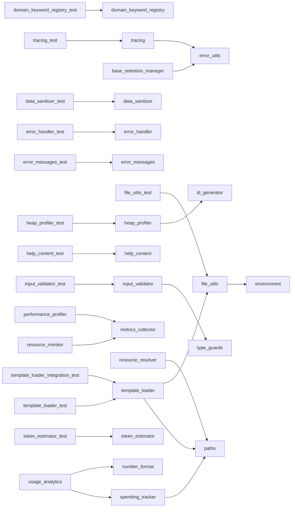

# Module: `utils`

_Generated: 2026-04-18_

## File Dependencies

## Symbol References

| Symbol                           | Kind      | Defined in                      | Used in                                                                                                                                                                                                                                                                                                                                                                                                                                                                                                                                                      |
| -------------------------------- | --------- | ------------------------------- | ------------------------------------------------------------------------------------------------------------------------------------------------------------------------------------------------------------------------------------------------------------------------------------------------------------------------------------------------------------------------------------------------------------------------------------------------------------------------------------------------------------------------------------------------------------ |
| AccuracyUtils                    | class     | agent-selection-test-helpers.ts | —                                                                                                                                                                                                                                                                                                                                                                                                                                                                                                                                                            |
| ActualCostResult                 | interface | token-estimator.ts              | —                                                                                                                                                                                                                                                                                                                                                                                                                                                                                                                                                            |
| assertArray                      | function  | type-guards.ts                  | —                                                                                                                                                                                                                                                                                                                                                                                                                                                                                                                                                            |
| assertDefined                    | function  | type-guards.ts                  | —                                                                                                                                                                                                                                                                                                                                                                                                                                                                                                                                                            |
| AssertionUtils                   | class     | agent-selection-test-helpers.ts | —                                                                                                                                                                                                                                                                                                                                                                                                                                                                                                                                                            |
| assertNonEmptyArray              | function  | type-guards.ts                  | —                                                                                                                                                                                                                                                                                                                                                                                                                                                                                                                                                            |
| assertObject                     | function  | type-guards.ts                  | —                                                                                                                                                                                                                                                                                                                                                                                                                                                                                                                                                            |
| assertString                     | function  | type-guards.ts                  | —                                                                                                                                                                                                                                                                                                                                                                                                                                                                                                                                                            |
| assertStringWithPattern          | function  | type-guards.ts                  | —                                                                                                                                                                                                                                                                                                                                                                                                                                                                                                                                                            |
| BaseCleanupResult                | interface | base-retention-manager.ts       | retention-manager.ts, retention-manager.ts                                                                                                                                                                                                                                                                                                                                                                                                                                                                                                                   |
| BaseCleanupSchedule              | interface | base-cleanup-scheduler.ts       | cleanup-scheduler.ts, cleanup-scheduler.ts                                                                                                                                                                                                                                                                                                                                                                                                                                                                                                                   |
| BaseError                        | class     | error-handler.ts                | command-error-handler.ts, error-handler.test.ts                                                                                                                                                                                                                                                                                                                                                                                                                                                                                                              |
| BaseFileInfo                     | interface | base-retention-manager.ts       | retention-manager.ts, retention-manager.ts                                                                                                                                                                                                                                                                                                                                                                                                                                                                                                                   |
| BaseRetentionPolicy              | interface | base-retention-manager.ts       | retention-manager.ts, retention-manager.ts                                                                                                                                                                                                                                                                                                                                                                                                                                                                                                                   |
| calculateActualCost              | function  | token-estimator.ts              | command-executor.ts, processing-feedback.ts, token-estimator.test.ts                                                                                                                                                                                                                                                                                                                                                                                                                                                                                         |
| checkReDoSRisk                   | function  | safe-regex.ts                   | hook-execution.service.ts, safe-regex.test.ts                                                                                                                                                                                                                                                                                                                                                                                                                                                                                                                |
| CodeExampleValidation            | interface | docs-linter.ts                  | —                                                                                                                                                                                                                                                                                                                                                                                                                                                                                                                                                            |
| COMMAND_HELP                     | constant  | help-content.ts                 | —                                                                                                                                                                                                                                                                                                                                                                                                                                                                                                                                                            |
| CommandExample                   | interface | help-content.ts                 | —                                                                                                                                                                                                                                                                                                                                                                                                                                                                                                                                                            |
| CommandExecutionError            | class     | safe-exec.ts                    | —                                                                                                                                                                                                                                                                                                                                                                                                                                                                                                                                                            |
| CommandHelp                      | interface | help-content.ts                 | help-formatter.ts                                                                                                                                                                                                                                                                                                                                                                                                                                                                                                                                            |
| CommandOption                    | interface | help-content.ts                 | —                                                                                                                                                                                                                                                                                                                                                                                                                                                                                                                                                            |
| CommandUsage                     | interface | usage-analytics.ts              | usage.ts                                                                                                                                                                                                                                                                                                                                                                                                                                                                                                                                                     |
| ConsoleInterceptor               | class     | console-interceptor.ts          | —                                                                                                                                                                                                                                                                                                                                                                                                                                                                                                                                                            |
| CounterMetric                    | interface | metrics-collector.ts            | use-metrics-data.ts                                                                                                                                                                                                                                                                                                                                                                                                                                                                                                                                          |
| createDeletedFileDiff            | function  | diff-generator.ts               | dry-run-simulator.service.ts                                                                                                                                                                                                                                                                                                                                                                                                                                                                                                                                 |
| createHeapSnapshot               | function  | heap-profiler.ts                | monitoring.ts, system-monitor.ts, heap-profiler.test.ts                                                                                                                                                                                                                                                                                                                                                                                                                                                                                                      |
| createNewFileDiff                | function  | diff-generator.ts               | dry-run-simulator.service.ts                                                                                                                                                                                                                                                                                                                                                                                                                                                                                                                                 |
| DailyUsage                       | interface | usage-analytics.ts              | usage.ts                                                                                                                                                                                                                                                                                                                                                                                                                                                                                                                                                     |
| DataSanitizer                    | class     | data-sanitizer.ts               | data-sanitizer.test.ts                                                                                                                                                                                                                                                                                                                                                                                                                                                                                                                                       |
| DecryptionResult                 | interface | encryption.ts                   | —                                                                                                                                                                                                                                                                                                                                                                                                                                                                                                                                                            |
| DiffResult                       | interface | diff-generator.ts               | dry-run-simulator.service.ts                                                                                                                                                                                                                                                                                                                                                                                                                                                                                                                                 |
| DirectoryNotFoundError           | class     | file-utils.ts                   | file-utils.test.ts                                                                                                                                                                                                                                                                                                                                                                                                                                                                                                                                           |
| DocumentationLinter              | class     | docs-linter.ts                  | —                                                                                                                                                                                                                                                                                                                                                                                                                                                                                                                                                            |
| DocumentationRule                | interface | docs-linter.ts                  | —                                                                                                                                                                                                                                                                                                                                                                                                                                                                                                                                                            |
| DocumentationStats               | interface | docs-linter.ts                  | —                                                                                                                                                                                                                                                                                                                                                                                                                                                                                                                                                            |
| DomainKeywordRegistry            | class     | domain-keyword-registry.ts      | task-classifier.service.ts, domain-keyword-registry.test.ts                                                                                                                                                                                                                                                                                                                                                                                                                                                                                                  |
| EncryptedData                    | interface | encryption.ts                   | —                                                                                                                                                                                                                                                                                                                                                                                                                                                                                                                                                            |
| EncryptionOptions                | interface | encryption.ts                   | —                                                                                                                                                                                                                                                                                                                                                                                                                                                                                                                                                            |
| EncryptionUtil                   | class     | encryption.ts                   | —                                                                                                                                                                                                                                                                                                                                                                                                                                                                                                                                                            |
| EndpointSummary                  | interface | spending-tracker.ts             | —                                                                                                                                                                                                                                                                                                                                                                                                                                                                                                                                                            |
| ERROR_MESSAGES                   | constant  | error-messages.ts               | —                                                                                                                                                                                                                                                                                                                                                                                                                                                                                                                                                            |
| ErrorContext                     | interface | error-handler.ts                | error-handler.test.ts                                                                                                                                                                                                                                                                                                                                                                                                                                                                                                                                        |
| ErrorMessageTemplate             | interface | error-messages.ts               | —                                                                                                                                                                                                                                                                                                                                                                                                                                                                                                                                                            |
| escapeRegExp                     | function  | safe-regex.ts                   | output-parsing.service.ts, safe-regex.test.ts                                                                                                                                                                                                                                                                                                                                                                                                                                                                                                                |
| estimateTokens                   | function  | token-estimator.ts              | ast-context.service.ts, dry-run-preview.service.ts                                                                                                                                                                                                                                                                                                                                                                                                                                                                                                           |
| estimateTokensFromText           | function  | token-estimator.ts              | anthropic.provider.ts                                                                                                                                                                                                                                                                                                                                                                                                                                                                                                                                        |
| ExecResult                       | interface | safe-exec.ts                    | —                                                                                                                                                                                                                                                                                                                                                                                                                                                                                                                                                            |
| extractCodeBlocks                | function  | markdown-parser.ts              | —                                                                                                                                                                                                                                                                                                                                                                                                                                                                                                                                                            |
| extractHeadings                  | function  | markdown-parser.ts              | —                                                                                                                                                                                                                                                                                                                                                                                                                                                                                                                                                            |
| extractSections                  | function  | markdown-parser.ts              | —                                                                                                                                                                                                                                                                                                                                                                                                                                                                                                                                                            |
| FileLockManager                  | class     | file-lock.ts                    | —                                                                                                                                                                                                                                                                                                                                                                                                                                                                                                                                                            |
| formatAge                        | function  | format-helpers.ts               | tool-calls-panel.tsx, active-sessions-panel.tsx, recent-commands-panel.tsx, audit-log-view.tsx                                                                                                                                                                                                                                                                                                                                                                                                                                                               |
| formatDiffForDisplay             | function  | diff-generator.ts               | —                                                                                                                                                                                                                                                                                                                                                                                                                                                                                                                                                            |
| formatDuration                   | function  | number-format.ts                | feedback-presenter.ts                                                                                                                                                                                                                                                                                                                                                                                                                                                                                                                                        |
| formatDurationMs                 | function  | format-helpers.ts               | session-formatter.ts, verbose-formatter.ts, command-history-panel.tsx, exploration-info-panel.tsx, running-task-panel.tsx, worktree-stats-panel.tsx, background-tasks-panel.tsx, system-health-panel.tsx, cache-stats-view.tsx                                                                                                                                                                                                                                                                                                                               |
| formatDurationMs                 | function  | number-format.ts                | session-formatter.ts, verbose-formatter.ts, command-history-panel.tsx, exploration-info-panel.tsx, running-task-panel.tsx, worktree-stats-panel.tsx, background-tasks-panel.tsx, system-health-panel.tsx, cache-stats-view.tsx                                                                                                                                                                                                                                                                                                                               |
| formatErrorMessage               | function  | error-utils.ts                  | command-executor.ts, doctor.ts, help.ts, document-output-processor.ts, provider-fallback-service.ts, provider-resolver.ts, loader.ts, hook-execution.service.ts, stage-executor.ts, tool-execution.service.ts, container-manager.ts, dashboard-controls.tsx, execution-modes.ts, merge-orchestrator.ts, cursor.provider.ts, cleanup-scheduler.ts, retention-manager.ts, document-writer.service.ts, dynamic-agent-resolver.service.ts, idempotency-store.service.ts, retention-manager.ts, retention-policy-runner.ts, base-retention-manager.ts, tracing.ts |
| formatNumber                     | function  | number-format.ts                | monitoring.ts, usage.ts, result-presenter.ts, processing-feedback.ts, verbose-formatter.ts, command-history-panel.tsx, session-info-panel.tsx, spending-panel.tsx, token-usage-panel.tsx, active-sessions-panel.tsx, metrics-summary-panel.tsx, usage-analytics-view.tsx, usage-analytics.ts                                                                                                                                                                                                                                                                 |
| formatNumberWithSeparators       | function  | number-format.ts                | —                                                                                                                                                                                                                                                                                                                                                                                                                                                                                                                                                            |
| formatTokenEstimate              | function  | token-estimator.ts              | dry-run-preview.service.ts                                                                                                                                                                                                                                                                                                                                                                                                                                                                                                                                   |
| GaugeMetric                      | interface | metrics-collector.ts            | use-metrics-data.ts                                                                                                                                                                                                                                                                                                                                                                                                                                                                                                                                          |
| generateDecisionId               | function  | id-generator.ts                 | collaboration-coordinator.ts                                                                                                                                                                                                                                                                                                                                                                                                                                                                                                                                 |
| generateExplorationId            | function  | id-generator.ts                 | exploration-state.ts                                                                                                                                                                                                                                                                                                                                                                                                                                                                                                                                         |
| generateId                       | function  | id-generator.ts                 | request-handler.ts                                                                                                                                                                                                                                                                                                                                                                                                                                                                                                                                           |
| generateInsightId                | function  | id-generator.ts                 | collaboration-coordinator.ts                                                                                                                                                                                                                                                                                                                                                                                                                                                                                                                                 |
| generateMemoryId                 | function  | id-generator.ts                 | manager.ts                                                                                                                                                                                                                                                                                                                                                                                                                                                                                                                                                   |
| generateSessionId                | function  | id-generator.ts                 | store.ts                                                                                                                                                                                                                                                                                                                                                                                                                                                                                                                                                     |
| generateShortId                  | function  | id-generator.ts                 | heap-profiler.ts                                                                                                                                                                                                                                                                                                                                                                                                                                                                                                                                             |
| generateSpanId                   | function  | tracing.ts                      | tracing.test.ts                                                                                                                                                                                                                                                                                                                                                                                                                                                                                                                                              |
| generateTraceId                  | function  | tracing.ts                      | tracing.test.ts                                                                                                                                                                                                                                                                                                                                                                                                                                                                                                                                              |
| generateUnifiedDiff              | function  | diff-generator.ts               | dry-run-simulator.service.ts                                                                                                                                                                                                                                                                                                                                                                                                                                                                                                                                 |
| getAllCommandNames               | function  | help-content.ts                 | help.ts, help-content.test.ts                                                                                                                                                                                                                                                                                                                                                                                                                                                                                                                                |
| getCommandHelp                   | function  | help-content.ts                 | dynamic.ts, help.ts, help-formatter.test.ts, help-content.test.ts                                                                                                                                                                                                                                                                                                                                                                                                                                                                                            |
| getCommandsByPhase               | function  | help-content.ts                 | help-content.test.ts                                                                                                                                                                                                                                                                                                                                                                                                                                                                                                                                         |
| getContextColor                  | function  | format-helpers.ts               | session-info-panel.tsx, active-sessions-panel.tsx                                                                                                                                                                                                                                                                                                                                                                                                                                                                                                            |
| getEnvironmentSummary            | function  | environment.ts                  | command-error-handler.ts                                                                                                                                                                                                                                                                                                                                                                                                                                                                                                                                     |
| getErrorCodes                    | function  | error-messages.ts               | error-messages.test.ts                                                                                                                                                                                                                                                                                                                                                                                                                                                                                                                                       |
| getErrorMessage                  | function  | error-messages.ts               | command-error-handler.ts, error-messages.test.ts                                                                                                                                                                                                                                                                                                                                                                                                                                                                                                             |
| getErrorStack                    | function  | error-utils.ts                  | —                                                                                                                                                                                                                                                                                                                                                                                                                                                                                                                                                            |
| getExplorationStatusColor        | function  | format-helpers.ts               | exploration-info-panel.tsx, worktree-diagram-panel.tsx                                                                                                                                                                                                                                                                                                                                                                                                                                                                                                       |
| getFileLockManager               | function  | file-lock.ts                    | smoke.test.ts, collaboration-coordinator.ts, idempotency-store.service.ts                                                                                                                                                                                                                                                                                                                                                                                                                                                                                    |
| getGlobalConfigDir               | function  | paths.ts                        | doctor.ts, first-run-setup.ts, loader.ts                                                                                                                                                                                                                                                                                                                                                                                                                                                                                                                     |
| getGlobalFlagsByCategory         | function  | help-content.ts                 | help-formatter.ts                                                                                                                                                                                                                                                                                                                                                                                                                                                                                                                                            |
| getGlobalPluginsDir              | function  | paths.ts                        | plugin-discovery.service.ts                                                                                                                                                                                                                                                                                                                                                                                                                                                                                                                                  |
| getHeapProfiler                  | function  | heap-profiler.ts                | heap-profiler.test.ts                                                                                                                                                                                                                                                                                                                                                                                                                                                                                                                                        |
| getModelPricing                  | function  | token-estimator.ts              | stage-executor.ts, token-estimator.test.ts                                                                                                                                                                                                                                                                                                                                                                                                                                                                                                                   |
| getPackageDataDir                | function  | paths.ts                        | doctor.ts, loader.ts, agent-loader.ts, command-discovery.ts, hook-execution.service.ts, prompt-loader.ts, mcp-client-manager.service.ts, agent-capability-registry.service.test.ts, agent-capability-registry.service.ts, resource-resolver.ts, template-loader.ts                                                                                                                                                                                                                                                                                           |
| getPackagePluginsDir             | function  | paths.ts                        | plugin-discovery.service.ts                                                                                                                                                                                                                                                                                                                                                                                                                                                                                                                                  |
| getPackageRoot                   | function  | paths.ts                        | doctor.ts, hook-execution.service.ts, server.ts                                                                                                                                                                                                                                                                                                                                                                                                                                                                                                              |
| getProjectConfigDir              | function  | paths.ts                        | doctor.ts, loader.ts, resource-resolver.ts                                                                                                                                                                                                                                                                                                                                                                                                                                                                                                                   |
| getProjectPluginsDir             | function  | paths.ts                        | plugin-discovery.service.ts                                                                                                                                                                                                                                                                                                                                                                                                                                                                                                                                  |
| GetRecordsOptions                | interface | spending-tracker.ts             | monitoring.ts, usage-analytics.ts                                                                                                                                                                                                                                                                                                                                                                                                                                                                                                                            |
| getRuntimeDataDir                | function  | paths.ts                        | batch-session.ts, coordinator.ts, config.ts, stage-output-cache.ts, session-tools.service.ts, exploration-state.ts, mcp-approval-cache.service.ts, mcp-audit-logger.service.ts, store.ts, logger.ts, idempotency-store.service.ts, store.ts, spending-tracker.ts                                                                                                                                                                                                                                                                                             |
| getSpendingTracker               | function  | spending-tracker.ts             | command-executor.ts, monitoring.ts, spending-panel.tsx, token-usage-panel.tsx, usage-analytics.ts                                                                                                                                                                                                                                                                                                                                                                                                                                                            |
| getStatusColor                   | function  | format-helpers.ts               | session-info-panel.tsx                                                                                                                                                                                                                                                                                                                                                                                                                                                                                                                                       |
| getTemplateLoader                | function  | template-loader.ts              | cursor.provider.ts, template-loader.integration.test.ts, template-loader.test.ts                                                                                                                                                                                                                                                                                                                                                                                                                                                                             |
| getWorktreeStatusIcon            | function  | format-helpers.ts               | worktree-diagram-panel.tsx                                                                                                                                                                                                                                                                                                                                                                                                                                                                                                                                   |
| GLOBAL_FLAGS                     | constant  | help-content.ts                 | —                                                                                                                                                                                                                                                                                                                                                                                                                                                                                                                                                            |
| GlobalFlagHelp                   | interface | help-content.ts                 | —                                                                                                                                                                                                                                                                                                                                                                                                                                                                                                                                                            |
| handlePromptCancellation         | function  | prompt-handler.ts               | index.ts                                                                                                                                                                                                                                                                                                                                                                                                                                                                                                                                                     |
| hasCommandHelp                   | function  | help-content.ts                 | help.ts, help-content.test.ts                                                                                                                                                                                                                                                                                                                                                                                                                                                                                                                                |
| hasErrorMessage                  | function  | error-messages.ts               | command-error-handler.ts, error-messages.test.ts                                                                                                                                                                                                                                                                                                                                                                                                                                                                                                             |
| hasKnownPricing                  | function  | token-estimator.ts              | —                                                                                                                                                                                                                                                                                                                                                                                                                                                                                                                                                            |
| HeapDumpOptions                  | interface | heap-profiler.ts                | —                                                                                                                                                                                                                                                                                                                                                                                                                                                                                                                                                            |
| HeapProfiler                     | class     | heap-profiler.ts                | heap-profiler.test.ts                                                                                                                                                                                                                                                                                                                                                                                                                                                                                                                                        |
| HistogramMetric                  | interface | metrics-collector.ts            | use-metrics-data.ts                                                                                                                                                                                                                                                                                                                                                                                                                                                                                                                                          |
| InputValidationError             | class     | input-validator.ts              | security.test.ts                                                                                                                                                                                                                                                                                                                                                                                                                                                                                                                                             |
| isDevelopmentEnvironment         | function  | environment.ts                  | —                                                                                                                                                                                                                                                                                                                                                                                                                                                                                                                                                            |
| isError                          | function  | error-utils.ts                  | —                                                                                                                                                                                                                                                                                                                                                                                                                                                                                                                                                            |
| isNetworkRestricted              | function  | environment.ts                  | —                                                                                                                                                                                                                                                                                                                                                                                                                                                                                                                                                            |
| isNonEmptyArray                  | function  | type-guards.ts                  | stage-validation.service.ts, session-cleanup-ui.ts                                                                                                                                                                                                                                                                                                                                                                                                                                                                                                           |
| isNonEmptyObject                 | function  | type-guards.ts                  | —                                                                                                                                                                                                                                                                                                                                                                                                                                                                                                                                                            |
| isNonEmptyString                 | function  | type-guards.ts                  | document-output-processor.ts, command-discovery.ts, session-tools.service.ts, input-validator.ts                                                                                                                                                                                                                                                                                                                                                                                                                                                             |
| isObject                         | function  | type-guards.ts                  | —                                                                                                                                                                                                                                                                                                                                                                                                                                                                                                                                                            |
| isProductionEnvironment          | function  | environment.ts                  | —                                                                                                                                                                                                                                                                                                                                                                                                                                                                                                                                                            |
| isPromptCancellation             | function  | prompt-handler.ts               | first-run-setup.ts, index.ts, provider-mismatch-handler.ts, interactive-wizard.ts, validation-helpers.ts                                                                                                                                                                                                                                                                                                                                                                                                                                                     |
| isSandboxedEnvironment           | function  | environment.ts                  | command-error-handler.ts                                                                                                                                                                                                                                                                                                                                                                                                                                                                                                                                     |
| isTestEnvironment                | function  | environment.ts                  | —                                                                                                                                                                                                                                                                                                                                                                                                                                                                                                                                                            |
| isValidNumber                    | function  | type-guards.ts                  | —                                                                                                                                                                                                                                                                                                                                                                                                                                                                                                                                                            |
| LintOptions                      | interface | docs-linter.ts                  | —                                                                                                                                                                                                                                                                                                                                                                                                                                                                                                                                                            |
| LintResult                       | interface | docs-linter.ts                  | —                                                                                                                                                                                                                                                                                                                                                                                                                                                                                                                                                            |
| LockOptions                      | interface | file-lock.ts                    | —                                                                                                                                                                                                                                                                                                                                                                                                                                                                                                                                                            |
| markdownToSections               | function  | markdown-parser.ts              | —                                                                                                                                                                                                                                                                                                                                                                                                                                                                                                                                                            |
| MetricsCollector                 | class     | metrics-collector.ts            | stage-executor.ts                                                                                                                                                                                                                                                                                                                                                                                                                                                                                                                                            |
| MetricsOptions                   | interface | metrics-collector.ts            | —                                                                                                                                                                                                                                                                                                                                                                                                                                                                                                                                                            |
| MetricsSnapshot                  | interface | metrics-collector.ts            | use-metrics-data.ts                                                                                                                                                                                                                                                                                                                                                                                                                                                                                                                                          |
| MetricValue                      | interface | metrics-collector.ts            | —                                                                                                                                                                                                                                                                                                                                                                                                                                                                                                                                                            |
| MockUtils                        | class     | agent-selection-test-helpers.ts | —                                                                                                                                                                                                                                                                                                                                                                                                                                                                                                                                                            |
| ModelUsage                       | interface | usage-analytics.ts              | usage.ts                                                                                                                                                                                                                                                                                                                                                                                                                                                                                                                                                     |
| MonitoringOptions                | interface | resource-monitor.ts             | —                                                                                                                                                                                                                                                                                                                                                                                                                                                                                                                                                            |
| ParsedMarkdown                   | interface | yaml-parser.ts                  | —                                                                                                                                                                                                                                                                                                                                                                                                                                                                                                                                                            |
| PerformanceProfiler              | class     | performance-profiler.ts         | —                                                                                                                                                                                                                                                                                                                                                                                                                                                                                                                                                            |
| PerformanceReport                | interface | performance-profiler.ts         | —                                                                                                                                                                                                                                                                                                                                                                                                                                                                                                                                                            |
| PerformanceUtils                 | class     | agent-selection-test-helpers.ts | agent-selection-integration.integration.test.ts                                                                                                                                                                                                                                                                                                                                                                                                                                                                                                              |
| ProfileResult                    | interface | performance-profiler.ts         | —                                                                                                                                                                                                                                                                                                                                                                                                                                                                                                                                                            |
| ProfilingOptions                 | interface | performance-profiler.ts         | —                                                                                                                                                                                                                                                                                                                                                                                                                                                                                                                                                            |
| RateLimitEntry                   | interface | rate-limiter.ts                 | —                                                                                                                                                                                                                                                                                                                                                                                                                                                                                                                                                            |
| RateLimiter                      | class     | rate-limiter.ts                 | container.ts                                                                                                                                                                                                                                                                                                                                                                                                                                                                                                                                                 |
| RateLimitOptions                 | interface | rate-limiter.ts                 | —                                                                                                                                                                                                                                                                                                                                                                                                                                                                                                                                                            |
| RateLimitRule                    | interface | rate-limiter.ts                 | —                                                                                                                                                                                                                                                                                                                                                                                                                                                                                                                                                            |
| RecoveryStrategy                 | interface | error-handler.ts                | error-handler.test.ts                                                                                                                                                                                                                                                                                                                                                                                                                                                                                                                                        |
| resetTemplateLoader              | function  | template-loader.ts              | template-loader.integration.test.ts, template-loader.test.ts                                                                                                                                                                                                                                                                                                                                                                                                                                                                                                 |
| ResourceAlert                    | interface | resource-monitor.ts             | system-monitor.ts                                                                                                                                                                                                                                                                                                                                                                                                                                                                                                                                            |
| ResourceInfo                     | interface | resource-resolver.ts            | —                                                                                                                                                                                                                                                                                                                                                                                                                                                                                                                                                            |
| ResourceMonitor                  | class     | resource-monitor.ts             | —                                                                                                                                                                                                                                                                                                                                                                                                                                                                                                                                                            |
| ResourceResolver                 | class     | resource-resolver.ts            | plugin-loader.service.ts                                                                                                                                                                                                                                                                                                                                                                                                                                                                                                                                     |
| ResourceThresholds               | interface | resource-monitor.ts             | —                                                                                                                                                                                                                                                                                                                                                                                                                                                                                                                                                            |
| ResourceType                     | type      | resource-resolver.ts            | —                                                                                                                                                                                                                                                                                                                                                                                                                                                                                                                                                            |
| ResourceUsage                    | interface | resource-monitor.ts             | —                                                                                                                                                                                                                                                                                                                                                                                                                                                                                                                                                            |
| RetentionLogger                  | interface | base-retention-manager.ts       | retention-manager.ts, retention-manager.ts                                                                                                                                                                                                                                                                                                                                                                                                                                                                                                                   |
| safeRegexTest                    | function  | safe-regex.ts                   | hook-execution.service.ts, safe-regex.test.ts                                                                                                                                                                                                                                                                                                                                                                                                                                                                                                                |
| SanitizationOptions              | interface | data-sanitizer.ts               | —                                                                                                                                                                                                                                                                                                                                                                                                                                                                                                                                                            |
| SanitizationRule                 | interface | data-sanitizer.ts               | data-sanitizer.test.ts                                                                                                                                                                                                                                                                                                                                                                                                                                                                                                                                       |
| ScenarioBuilder                  | class     | agent-selection-test-helpers.ts | agent-selection-integration.integration.test.ts                                                                                                                                                                                                                                                                                                                                                                                                                                                                                                              |
| searchCommands                   | function  | help-content.ts                 | help.ts, help-content.test.ts                                                                                                                                                                                                                                                                                                                                                                                                                                                                                                                                |
| shouldGracefullyHandleFileErrors | function  | environment.ts                  | file-utils.ts                                                                                                                                                                                                                                                                                                                                                                                                                                                                                                                                                |
| Span                             | class     | tracing.ts                      | tool-execution.service.ts, tracing.types.ts, tracing.test.ts                                                                                                                                                                                                                                                                                                                                                                                                                                                                                                 |
| SpawnOptions                     | interface | safe-exec.ts                    | —                                                                                                                                                                                                                                                                                                                                                                                                                                                                                                                                                            |
| SpendingRecord                   | interface | spending-tracker.ts             | usage.ts, usage-analytics.ts                                                                                                                                                                                                                                                                                                                                                                                                                                                                                                                                 |
| SpendingTotals                   | interface | spending-tracker.ts             | usage-analytics.ts                                                                                                                                                                                                                                                                                                                                                                                                                                                                                                                                           |
| SpendingTracker                  | class     | spending-tracker.ts             | usage-analytics.ts                                                                                                                                                                                                                                                                                                                                                                                                                                                                                                                                           |
| stripMarkdown                    | function  | markdown-parser.ts              | —                                                                                                                                                                                                                                                                                                                                                                                                                                                                                                                                                            |
| SubcommandHelp                   | interface | help-content.ts                 | help-formatter.ts                                                                                                                                                                                                                                                                                                                                                                                                                                                                                                                                            |
| TemplateLoader                   | class     | template-loader.ts              | template-loader.test.ts                                                                                                                                                                                                                                                                                                                                                                                                                                                                                                                                      |
| TemplateVariables                | interface | template-loader.ts              | —                                                                                                                                                                                                                                                                                                                                                                                                                                                                                                                                                            |
| TestcontainersHelper             | class     | testcontainers-helper.ts        | user-workflows.acceptance.test.ts, cli-commands.e2e.test.ts, error-handling.error.test.ts, config-file-integration.test.ts, performance-validation.performance.test.ts, security-validation.security.test.ts, setup.ts                                                                                                                                                                                                                                                                                                                                       |
| TestDataFactory                  | class     | agent-selection-test-helpers.ts | —                                                                                                                                                                                                                                                                                                                                                                                                                                                                                                                                                            |
| TestHelpers                      | variable  | agent-selection-test-helpers.ts | agent-selection-integration.integration.test.ts                                                                                                                                                                                                                                                                                                                                                                                                                                                                                                              |
| TimerResult                      | interface | metrics-collector.ts            | —                                                                                                                                                                                                                                                                                                                                                                                                                                                                                                                                                            |
| TokenEstimate                    | interface | token-estimator.ts              | dry-run-preview.service.ts                                                                                                                                                                                                                                                                                                                                                                                                                                                                                                                                   |
| UsageAnalytics                   | class     | usage-analytics.ts              | —                                                                                                                                                                                                                                                                                                                                                                                                                                                                                                                                                            |
| UsageAnalyticsOptions            | interface | usage-analytics.ts              | usage.ts                                                                                                                                                                                                                                                                                                                                                                                                                                                                                                                                                     |
| UsagePeriod                      | interface | usage-analytics.ts              | —                                                                                                                                                                                                                                                                                                                                                                                                                                                                                                                                                            |
| UsageSummary                     | interface | usage-analytics.ts              | usage.ts, use-usage-analytics-data.ts                                                                                                                                                                                                                                                                                                                                                                                                                                                                                                                        |
| ValidationResult                 | interface | input-validator.ts              | command-validator.ts, review-code-presenter.ts, request-handler.ts, sampling-service.ts                                                                                                                                                                                                                                                                                                                                                                                                                                                                      |
| withPromptCancellation           | function  | prompt-handler.ts               | —                                                                                                                                                                                                                                                                                                                                                                                                                                                                                                                                                            |
| WORKFLOW_PHASES                  | constant  | help-content.ts                 | help-formatter.ts                                                                                                                                                                                                                                                                                                                                                                                                                                                                                                                                            |
| WriteOptions                     | interface | file-lock.ts                    | —                                                                                                                                                                                                                                                                                                                                                                                                                                                                                                                                                            |
| YamlParseError                   | class     | yaml-parser.ts                  | agent-loader.ts, command-validation.ts, prompt-loader.ts                                                                                                                                                                                                                                                                                                                                                                                                                                                                                                     |
