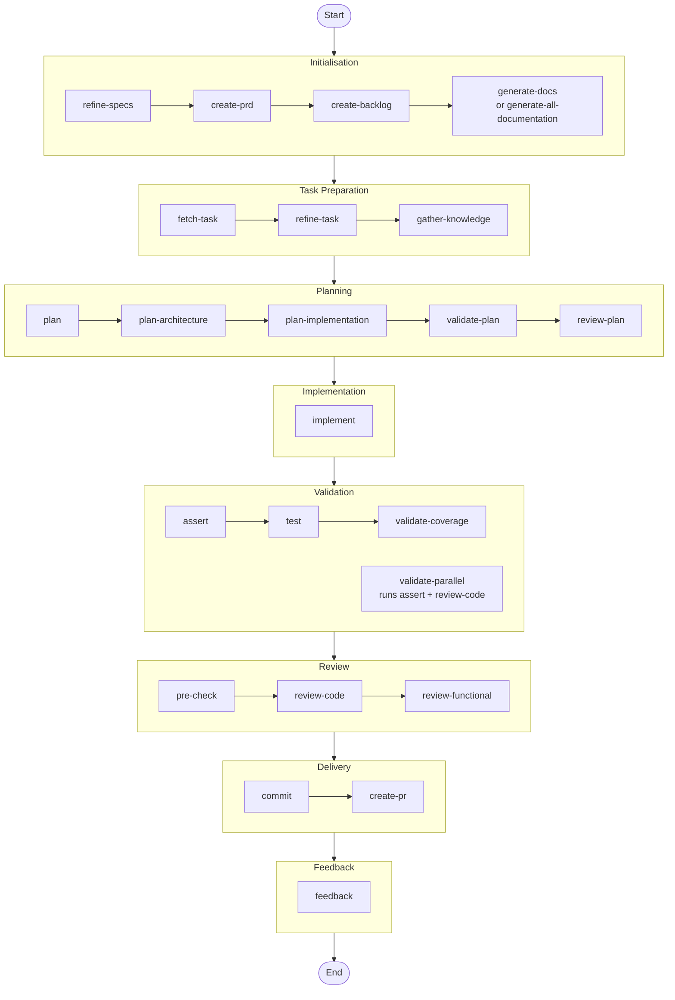

# Development Workflows

Common patterns for using VALORA effectively.

## The Complete Development Lifecycle



## Workflow Summary

| Workflow                                                        | When to Use                       | Key Commands                              |
| --------------------------------------------------------------- | --------------------------------- | ----------------------------------------- |
| [New Feature](#workflow-1-new-feature-development)              | Starting fresh                    | Full lifecycle                            |
| [Bug Fix](#workflow-2-bug-fix)                                  | Fixing issues                     | plan, implement, test, commit             |
| [Refactoring](#workflow-3-refactoring)                          | Code improvements                 | plan, implement (step-by-step), test      |
| [Code Review](#workflow-4-code-review)                          | Before merging                    | review-code, review-functional            |
| [Tiered Planning](#workflow-5-tiered-planning-complex-features) | Complex features (complexity > 5) | plan-architecture, plan-implementation    |
| [Quick Task](#workflow-6-quick-task)                            | Small, well-defined tasks         | fetch-task, plan, implement, commit       |
| [Documentation](#workflow-7-documentation-generation)           | Generating technical docs         | generate-docs, generate-all-documentation |

---

## Workflow 1: New Feature Development

**Use when**: Starting a new feature from scratch.

```bash
valora refine-specs "User authentication with OAuth providers"
valora create-prd
valora create-backlog
valora generate-docs          # optional — 15 docs across infra/backend/frontend
valora fetch-task
valora refine-task
valora gather-knowledge --scope=task
valora plan
valora review-plan
valora implement
valora assert
valora test
valora review-code && valora review-functional
valora commit && valora create-pr
valora feedback
```

**Expected outcome**: A fully planned, implemented, reviewed, and committed feature with a pull request open.

<details>
<summary><strong>When to use each step — rationale and edge cases</strong></summary>

**refine-specs** engages the `@product-manager` agent, which pauses to ask clarifying questions grouped by priority (P0 → P1 → P2). Your answers are written into a "User Clarifications" section in `FUNCTIONAL.md`. **Do not skip this**: vague specs produce vague plans.

**create-prd** may trigger a second round of interactive clarification if the requirements analysis exposes ambiguities. The resulting Product Requirements Document in `PRD.md` feeds directly into backlog decomposition.

**create-backlog** uses `--granularity=fine` by default. For simpler features, `--granularity=coarse` reduces the number of tasks and speeds up the subsequent `fetch-task` / `refine-task` cycle.

**generate-docs** is optional but valuable for projects that lack documentation. It produces 15 documents across infrastructure, backend, and frontend domains. If time is short, use `valora generate-all-documentation` (parallel, ~8 min) or skip until after the first iteration.

**refine-task** may trigger a third round of interactive clarification when clarity gaps are identified. Your answers are applied to the task document and backlog.

**gather-knowledge** with `--scope=task` restricts codebase analysis to the current task context. Use `--scope=project` only when the task has broad cross-cutting concerns.

**plan** engages the `@lead` agent. It aggregates questions from complexity assessment, dependency analysis, and risk assessment into a single interactive pause. The resulting plan is written to `knowledge-base/PLAN-[TASK-ID].md`.

**review-plan** is a lightweight gate (~14 min full, ~3 min with `--checklist`). Use `--checklist` for most cases; reserve the full review for complexity ≥ 7.

**assert + test** run sequentially by default. Use `valora validate-parallel` to run both concurrently and save ~9 minutes.

**review-code + review-functional** can be preceded by `valora pre-check` (automated, ~1.5 min) to catch TypeScript, ESLint, Prettier, and security issues before the deeper manual review.

**feedback** records outcomes for continuous improvement. Always run it — it feeds the metrics system.

### Decision points during the workflow

| Decision                | Criteria                     | Action if false           |
| ----------------------- | ---------------------------- | ------------------------- |
| Sufficient context?     | Agent has enough information | Run `gather-knowledge`    |
| Plan quality validated? | `review-plan` passes         | Re-run `plan`             |
| Feature too large?      | Complexity exceeds threshold | Use `--mode=step-by-step` |
| Tests passed?           | All tests green              | Re-run `plan` and fix     |
| Reviews passed?         | Both reviews approved        | Re-implement              |

</details>

---

## Workflow 2: Bug Fix

**Use when**: Fixing a reported bug or issue.

```bash
valora gather-knowledge --scope=task --domain=<affected-area>
valora plan "Fix: <bug description>"
valora implement
valora assert
valora test --type=all
valora review-code --focus=security
valora review-functional
valora commit --scope=fix
valora feedback
```

**Expected outcome**: A targeted fix with validated tests and a conventional commit.

<details>
<summary><strong>Bug fix rationale and edge cases</strong></summary>

Start with `gather-knowledge` to understand the affected area before planning. Bug fixes benefit from `--domain=<area>` to restrict knowledge gathering to the relevant subsystem.

`--focus=security` on `review-code` is appropriate for bugs that may have security implications (e.g., input validation, authentication). For non-security bugs, omit the flag or use `--focus=all`.

If the bug is in a highly tested area, add `--coverage-threshold=80` to `valora test` to verify you haven't regressed coverage.

</details>

---

## Workflow 3: Refactoring

**Use when**: Improving code structure without changing functionality.

```bash
valora gather-knowledge --scope=project --depth=deep
valora plan "Refactor: <refactoring description>"
valora review-plan --strict-mode
valora implement --mode=step-by-step
valora test --type=all --coverage-threshold=80
valora review-code --focus=maintainability
valora commit --scope=refactor
```

**Expected outcome**: Improved code structure with no regressions and a verified test suite.

<details>
<summary><strong>Refactoring rationale and edge cases</strong></summary>

Use `--scope=project` with `gather-knowledge` when the refactoring spans multiple modules. For localised refactors, `--scope=task` is sufficient.

`--mode=step-by-step` is critical for large refactors. It breaks implementation into discrete, verifiable steps rather than making all changes at once. Each step can be validated individually before proceeding.

`--strict-mode` on `review-plan` enforces stricter validation criteria and is appropriate when refactoring load-bearing code. It adds ~5 minutes but catches architectural regressions early.

`--focus=maintainability` on `review-code` specifically evaluates readability, naming, and structure — the primary goals of a refactor.

</details>

---

## Workflow 4: Code Review

**Use when**: Reviewing code before merging.

```bash
valora pre-check
valora review-code --severity=high --focus=all
valora review-functional --check-a11y=true
valora test
valora feedback --command=review-code
```

**Expected outcome**: Code quality and functional correctness confirmed, with issues documented.

<details>
<summary><strong>Code review rationale and time-saving options</strong></summary>

**Two-phase approach saves ~36–56% of review time**:

| Approach                        | Time     | Savings |
| ------------------------------- | -------- | ------- |
| Full manual review              | 10.2 min | —       |
| pre-check + architecture review | 6.5 min  | 36%     |
| pre-check + checklist review    | 4.5 min  | 56%     |

**pre-check** runs automated checks (~1.5 min total):

| Check       | Purpose            | Duration |
| ----------- | ------------------ | -------- |
| TypeScript  | Type validation    | ~12s     |
| ESLint      | Code quality       | ~8s      |
| Prettier    | Formatting         | ~3s      |
| Security    | Vulnerability scan | ~5s      |
| Quick Tests | Regression check   | ~20s     |

If `pre-check` finds issues, use `valora pre-check --fix` to apply auto-fixes before proceeding to the manual review.

`--check-a11y=true` on `review-functional` includes accessibility validation. Omit it for backend-only changes.

</details>

---

## Workflow 5: Tiered Planning (Complex Features)

**Use when**: Working on complex features (complexity > 5) that benefit from architectural review before detailed planning.

```bash
valora fetch-task --task-id=<id>
valora gather-knowledge --scope=task
valora plan-architecture
valora review-plan --checklist          # fast gate (~3 min) before detailed planning
valora plan-implementation --arch-plan=knowledge-base/PLAN-ARCH-<TASK-ID>.md
valora review-plan --checklist
valora implement --plan=knowledge-base/PLAN-IMPL-<TASK-ID>.md
valora assert --quick=all
valora review-code --auto-only
```

**Expected outcome**: Architectural issues caught in ~5 minutes before committing to detailed planning, saving ~25 minutes per cycle.

<details>
<summary><strong>Tiered planning rationale and outputs</strong></summary>

**Why tiered planning?** Standard `valora plan` runs architecture and implementation planning sequentially in one pass. For complex features this means ~18 minutes of work before you discover an architectural problem. Tiered planning separates the phases:

- **Phase 1 — Architecture** (`plan-architecture`, ~5 min): Produces `knowledge-base/PLAN-ARCH-[TASK-ID].md` with technology choices, component boundaries, integration points, and a Go/No-Go decision.
- **Phase 2 — Implementation** (`plan-implementation`, ~10 min): Produces `knowledge-base/PLAN-IMPL-[TASK-ID].md` with step-by-step tasks, file paths, dependencies, risks, testing, and rollback procedures.

The `--checklist` flag on `review-plan` runs a fast binary validation (~3 min vs ~14 min full) between phases. Only proceed to Phase 2 if Phase 1 passes the checklist gate.

**Time savings**: ~25 min per planning cycle. Catches architectural issues before detailed planning, eliminates detailed planning on rejected architectures, and provides faster feedback through `--checklist` and `--quick` modes.

</details>

---

## Workflow 6: Quick Task

**Use when**: Handling a small, well-defined task (complexity < 3).

```bash
valora fetch-task --task-id=<id>
valora plan
valora implement
valora assert
valora test
valora commit
```

**Expected outcome**: A small, verified change committed in a single pass.

> **Tip**: For trivial tasks (updating a constant, fixing a typo), use `valora plan --mode=express` to reduce planning time from ~13 min to ~2–3 min.

---

## Workflow 7: Documentation Generation

**Use when**: Creating comprehensive technical documentation for a project.

Prerequisites: `knowledge-base/PRD.md`, `knowledge-base/FUNCTIONAL.md`, and `knowledge-base/BACKLOG.md` must exist.

### Choose your approach

| Approach               | Command                                      | Duration    | Best for                   |
| ---------------------- | -------------------------------------------- | ----------- | -------------------------- |
| Full pipeline          | `generate-docs`                              | ~14 min     | Single domain or templates |
| Parallel (all domains) | `generate-all-documentation`                 | ~8 min      | Full suite, time-critical  |
| Parallel with cache    | `generate-all-documentation --cache-context` | ~6.5 min    | Subsequent runs            |
| Fastest                | `generate-all-documentation --skip-review`   | ~5.5 min    | Speed over validation      |
| Quick mode             | `generate-docs --quick`                      | ~50% faster | Initial documentation      |

### Standard parallel generation

```bash
valora generate-all-documentation
```

### Domain-specific generation

```bash
valora generate-docs --domain=infrastructure
valora generate-docs --domain=backend
valora generate-docs --domain=frontend
```

### Verify output

```bash
ls -la knowledge-base/infrastructure/
ls -la knowledge-base/backend/
ls -la knowledge-base/frontend/
```

<details>
<summary><strong>Documentation output structure and quick-mode details</strong></summary>

**Output structure**:

```plaintext
knowledge-base/
├── infrastructure/
│   ├── HLD.md              # High-Level Design
│   ├── CONTAINER.md        # Container Architecture
│   ├── DEPLOYMENT.md       # Deployment Guide
│   ├── LOGGING.md          # Observability
│   ├── LZ.md               # Landing Zone
│   └── WORKFLOW.md         # Development Workflow
├── backend/
│   ├── ARCHITECTURE.md     # Backend Architecture
│   ├── API.md              # API Documentation
│   ├── DATA.md             # Data Architecture
│   ├── TESTING.md          # Testing Strategy
│   └── CODING-ASSERTIONS.md
└── frontend/
    ├── ARCHITECTURE.md     # Frontend Architecture
    ├── DESIGN.md           # Design System
    ├── TESTING.md          # Testing Strategy
    └── CODING-ASSERTIONS.md
```

**Quick mode (--extract-only → --quick)**:

1. Generate the extraction checklist:

   ```bash
   valora generate-docs --extract-only
   ```

   Produces `DOC_EXTRACTION_CHECKLIST.md` with automated commands to extract from code.

2. Fill the checklist manually (~10 min), then:
   ```bash
   valora generate-docs --quick
   ```
   Uses pre-built templates for faster generation.

**Adding security context**:

```bash
valora generate-all-documentation --security-context=.valora/security-requirements.json
```

Includes comprehensive security sections across all documents.

**Cache TTL**: `--cache-context` reuses cached context from previous runs with a 2-hour TTL. After `--skip-review`, run `valora validate-parallel` if post-hoc validation is needed.

**Available quick templates**:

| Template                      | Purpose                           |
| ----------------------------- | --------------------------------- |
| `DOC_EXTRACTION_CHECKLIST.md` | Systematic extraction from code   |
| `DOC_API_QUICK.md`            | API documentation skeleton        |
| `DOC_COMPONENT_QUICK.md`      | Component documentation           |
| `BACKEND_DOC.md`              | Backend document structure        |
| `FRONTEND_DOC.md`             | Frontend document structure       |
| `INFRASTRUCTURE_DOC.md`       | Infrastructure document structure |

</details>

---

## Interactive Clarification

Several commands pause execution to collect your input. Answers are incorporated into the final document under a "User Clarifications" section.

| Command        | Questions source                | Document updated    |
| -------------- | ------------------------------- | ------------------- |
| `refine-specs` | Specification refinement        | `FUNCTIONAL.md`     |
| `create-prd`   | Requirements analysis           | `PRD.md`            |
| `refine-task`  | Task clarity analysis           | `BACKLOG.md`        |
| `plan`         | Complexity, dependencies, risks | `PLAN-[TASK-ID].md` |

Questions are grouped by priority:

- **P0 (Critical)** — always answer; blocks core functionality
- **P1 (Important)** — affects significant features; can be skipped with noted assumptions
- **P2 (Minor)** — optional clarifications

---

## Speed-Up Options

Use these flags to reduce time across any workflow:

| Goal                  | Command                                   | Time saving        |
| --------------------- | ----------------------------------------- | ------------------ |
| Fast plan review      | `valora review-plan --checklist`          | ~3 min vs ~14 min  |
| Fast assertion        | `valora assert --quick=all`               | ~5 min vs ~9 min   |
| Fast code review      | `valora review-code --checklist`          | ~3 min vs ~10 min  |
| Automated checks only | `valora review-code --auto-only`          | ~1 min             |
| Parallel validation   | `valora validate-parallel`                | ~10 min vs ~19 min |
| Quick parallel        | `valora validate-parallel --quick`        | ~5 min             |
| Coverage gate         | `valora validate-coverage --threshold=80` | —                  |

### Pattern templates (planning)

Use `--pattern` to reduce planning time from 13–15 min to 4–6 min:

```bash
valora plan "Add users API" --pattern=rest-api
valora plan "Add dashboard" --pattern=react-feature
valora plan "Add orders table" --pattern=database
valora plan "Add OAuth login" --pattern=auth
valora plan "Add email queue" --pattern=background-job
```

| Pattern          | Template file                    | Use when                          |
| ---------------- | -------------------------------- | --------------------------------- |
| `rest-api`       | `PLAN_PATTERN_REST_API.md`       | API endpoints, CRUD resources     |
| `react-feature`  | `PLAN_PATTERN_REACT_FEATURE.md`  | React features, pages, components |
| `database`       | `PLAN_PATTERN_DATABASE.md`       | Tables, migrations, entities      |
| `auth`           | `PLAN_PATTERN_AUTH.md`           | Login, JWT, OAuth, RBAC           |
| `background-job` | `PLAN_PATTERN_BACKGROUND_JOB.md` | Async tasks, queues, workers      |

### Coverage validation gates

```bash
valora validate-coverage                         # 80% threshold (default)
valora validate-coverage --strict                # strict mode
valora validate-coverage --new-code-only         # only changed code
valora validate-coverage --strict --fail-on-decrease --report-format=json   # CI/CD
```

| Score | Grade | Action                        |
| ----- | ----- | ----------------------------- |
| ≥ 80  | A     | PASS                          |
| 70–79 | B     | PASS with recommendations     |
| 60–69 | C     | WARN — requires justification |
| < 60  | F     | FAIL — must improve           |
